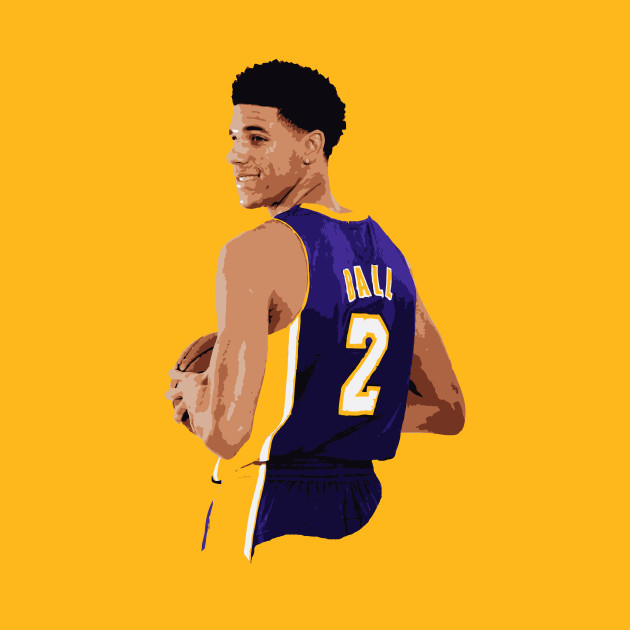
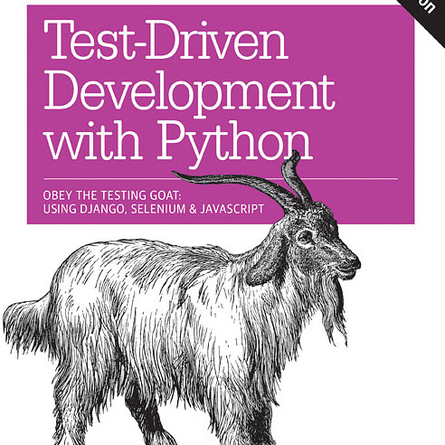

Proper Technique and fundamentals are very important in Basketball and Software Engineering. In order to be the "Greatest of All Time" (GOAT) like the future rookie of the year pictured to the right, we must first learn the fundamentals. Before we even talk about the fundamentals, we must first know the basic rules, like what is a function? How can we avoid founling? In software engineering term, What causes run time and link time errors and how do we avoid them?

Now that we know the rules to the game, we are then able to work on our fundamentals. When learning the fundamentals, we must focus on using proper technique. Learning the syntax of a language and proper documentation will help insure that you will not run into any errors. Learning the fundamentals can be boring at times, but it will make you and your team better no matter what age level or team you play for. Just like Lonzo "Goat" Ball, we all started our career by first learning the bas"ics."

In basketball the main objective is to get the ball into the opponent's hoop, there are many ways to do so. You can either pull a Lamelo "Goat Jr." Ball and shoot from half court or lay the ball in. This is what sparks my interest in software engineering. You can solve a problem in many different ways, but we must choose the most efficient algorithm. Here is where we rely on our knowledge of the "game."

