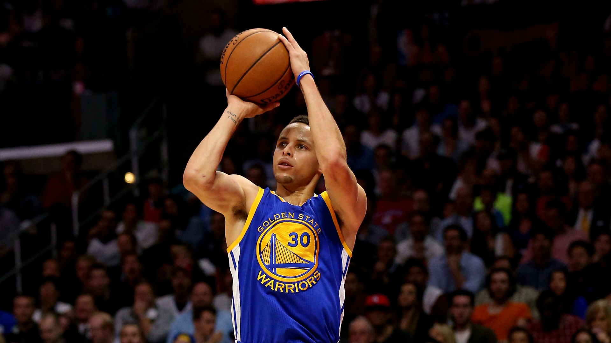
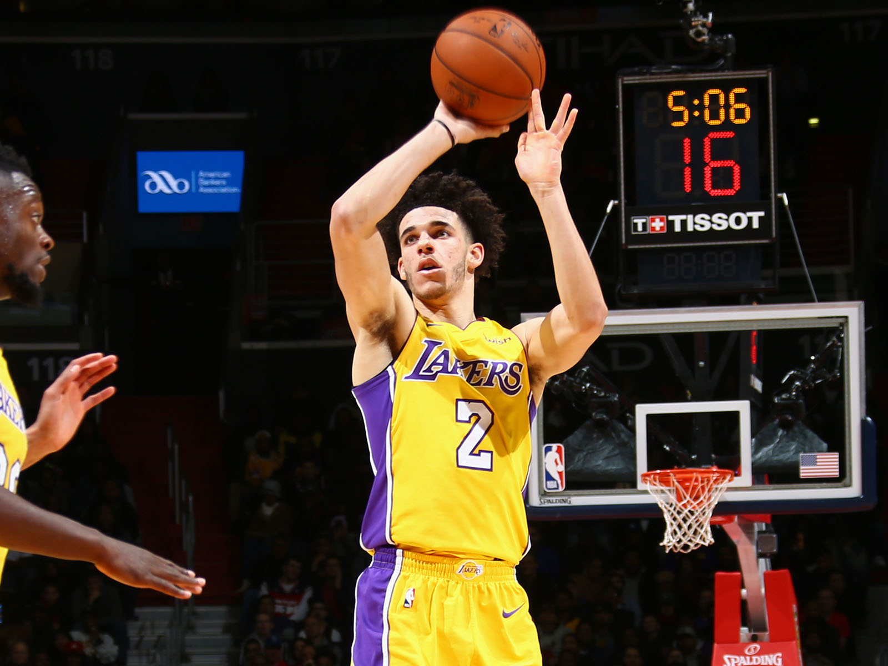

Ray "🐐" Allen and Stephen Curry are regarded as the greatest shooters of all time.
Throughout Ray Allen's eighteen seasons, his "wet" shooting form has allowed him to make 2973 3-point field goals with a 3-point field goal percentage of 40.02%. On the other hand, Stephen Curry has amassed 2086 3-point field goals with a 3-point field goal percantage of 43.6% through eight seasons. Stephen Curry is on track to dethron Ray Allen and become THE greatest shooter of all time. You may ask, what do these two legends have in common? Their hard work, will power, and determination to perfect there shooting form. By working on the correct fundamentals and by adhering to proper style guidelines, it will help me become an overall better programmer.

Now let's talk about Lonzo "🐐 jr" Ball, his first couple games in the NBA were rough, the NBA is nothing like college basketball. Just like Lonzo, the first few times using ESLint with IntelliJ was painful. I had a lot of errors regarding my format. But through these errors, I was able to learn proper coding style guidlines that make my code much more readable. Even though I still struggle with errors in ESLint, I am starting to enjoy minimizing the complaints ESLint spits out.
