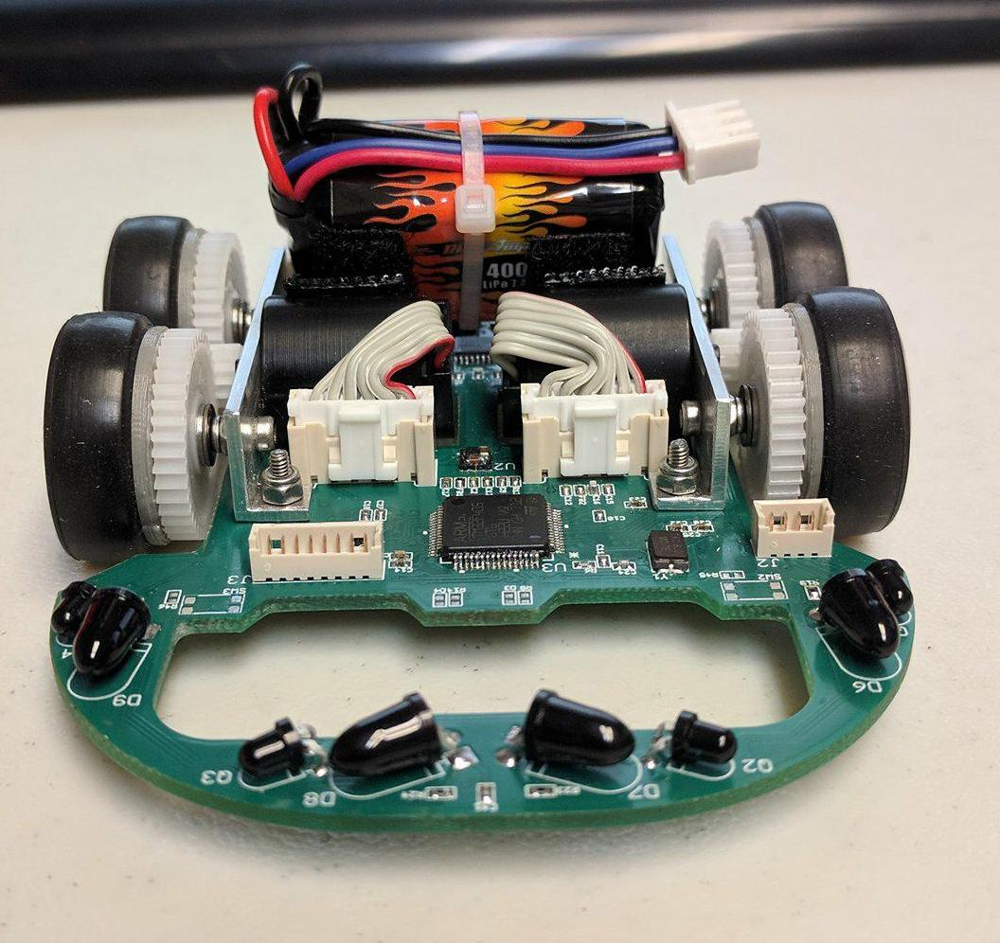

  
  
  
   

Micromouse is an event where small robot “mice” solve a 16 x 16 maze. Events are held worldwide. The maze is made up of a 16 by 16 gird of cells, each 180 mm square with walls 50 mm high. The mice are completely autonomous robots that must find their way from a predetermined starting position to the central area of the maze unaided. The mouse will need to keep track of where it is, discover walls as it explores, map out the maze and detect when it has reached the center. Having reached the center, the mouse will typically perform additional searches of the maze until it has found the most optimal route from the start to the center. Once the most optimal route has been determined, the mouse will run that route in the shortest possible time.

For this project, I worked on several modules in both the upper level software and low level firmware specifically: the display, ADC, movements, controllers, right wall hugger, and flood fill. A large portion of this project was dedicated to research, as prior to this project I had no experience working with firmware and the STM32 processor. I was able to expand on the five step design process that was learned from EE160. First I had to understand the problem, how does micromouse work? From there I was able to do a small hand example, which allowed me to create an algorithm and translated the algorithm to C. After running through all the test cases, I have verified and tested that the simulator works. From there, I then designed and implemented a flood fill algorithm for the simulator. I have also used the design process for the ADC, movements, display module, and porting over the flood fill to the mouse.

  This project has helped me gain real-world experience, improved my time management, and allowed me to learn more about this field/industry. In the real-world we may be asked to complete a task by a specific deadline. But, there may be times where you are not able to finish in time and must move on to the next task. This has happen to me as I was not able to implement the display in time. I have learned that it is better to move onto the next task rather than wasting time. This has also improved my time management skills as I should have probably allocated more time to the display. Overall, this project had allowed me to gain real-world experience and allowed me to learn more about this field.

We finished with the fastest mouse who finished the maze within our college.

You can learn more at the [UH Micromouse Website](http://www-ee.eng.hawaii.edu/~tep/Projects/F17/).
