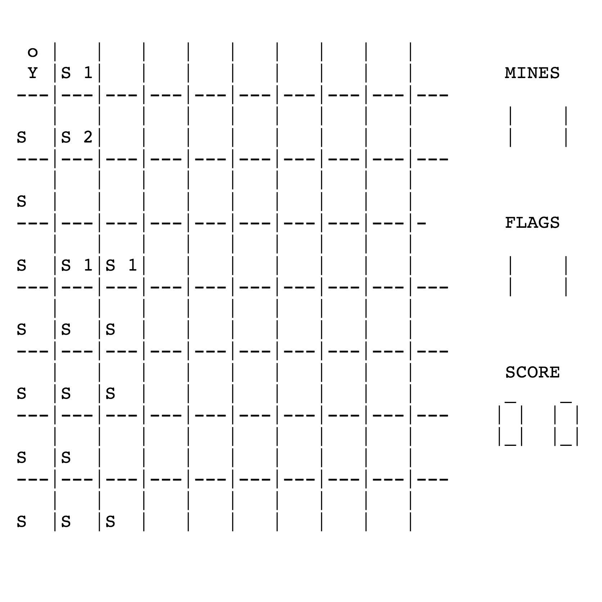

Miensfeld is a simple game that I helped create as a team project in EE160, Spring 2016. This project helped me learn how to break a big problem down into "bite-size" modules, decide what data structures and functions I need, and how to implement them.

Miensfeld is implemented using C. Within three weeks, we created several functions that allow the player to move around, plant flags, and earn points.

In

In this project I gained experience with full-stack web application design and associated technologies, including [MongoDB](http://mongodb.com) for database storage, the [Twitter Bootstrap](http://getbootstrap.com/) CSS Framework for the user interface, and Javascript for both client and server-side programming. 
 
