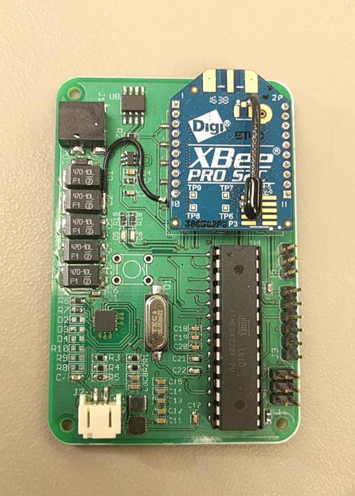
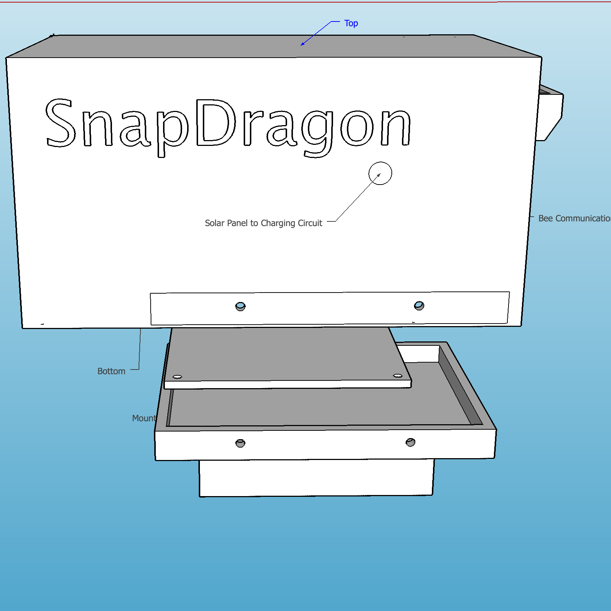
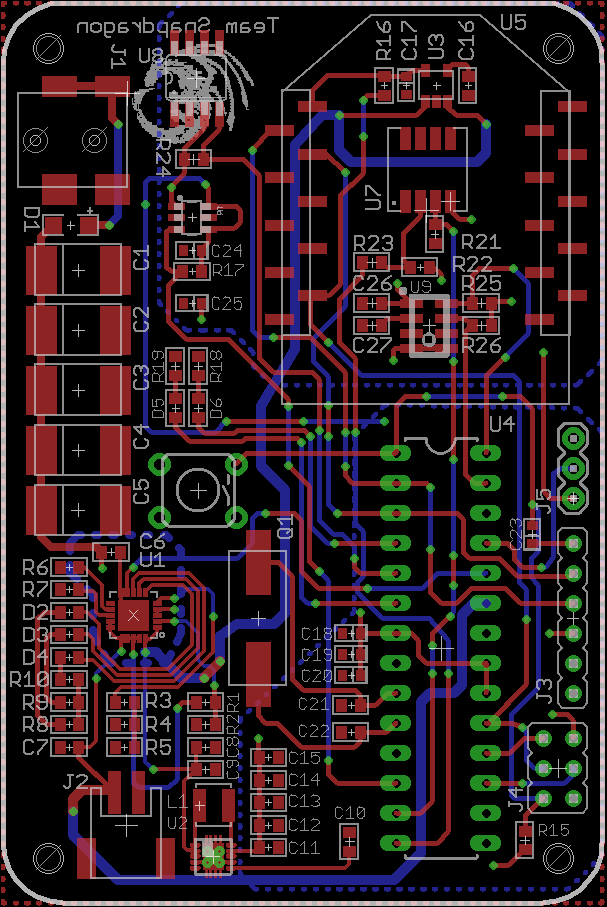
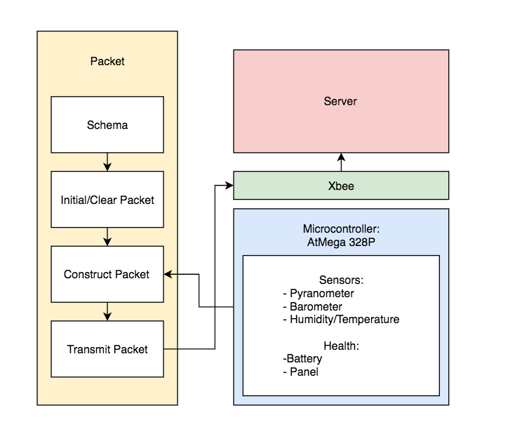

  
  
  
   

The objective for this project was to design a self-sustainable sensor node, otherwise known as a weatherbox, which collects weather and solar irradiance data which then gets sent over to a database for analysis and storage. This system would utilize two different methods of supplying power to the ATMEGA microcontroller, XBee wireless transceiver, and various on-board sensors. During the daytime, a solar panel is used to supply power for the weatherbox and to charge the system’s battery pack. When the sun sets and there isn’t enough power being supplied from the solar panel, the system will switch power sources to the battery which is able to keep the system powered until the solar panel becomes the primary power source during periods of daylight. This constant switching of power supplies enables our system to be truly self-sustainable. The sensor node has a plethora of sensors to collect barometric, humidity, solar irradiance, and temperature data and is programmed to poll the sensors at a user-specified period. The data is then consolidated into the appropriate packet format and is sent over to the lab database via an XBee wireless transceiver.

For this project, I was in charge of prototyping the weather box housing. With our custom PCB design which allowed us to replace the breakout board and Arduino, we were able to design the weather box to be compact with the following dimensions of 7” x 4” x 5”. There are two main components to our weather box which is the mount and housing itself. Our box was designed to be opened from the bottom to make it weathertight. The bottom of the weather box can be open or closed by screwing/unscrewing four 4-40 screws that connects the weather box housing to the mount. The mount was designed to be fastened to a clamp which is then placed to the top of Holmes Hall roof. 

Through the Weatherbox, we have gained an invaluable amount of technical knowledge about the hardware and software skills aspects of a project. More specifically, we were exposed to creating PCBs using EAGLE, soldering both surface mount and through-hole electronic components, 3D modeling using SketchUp, and programming the sensors using the Arduino platform.  In addition to the technical skills, this project also gave us the opportunity to refine our soft skills.  We learned to ask for help when needed, how to communicate effectively, and to manage our time in order to meet project deadlines. Furthermore, this project served as a learning tool for real-world applications of the engineering process. We learned to analyze the cost-benefits of our design choices and to make iterative improvements for future revisions.

