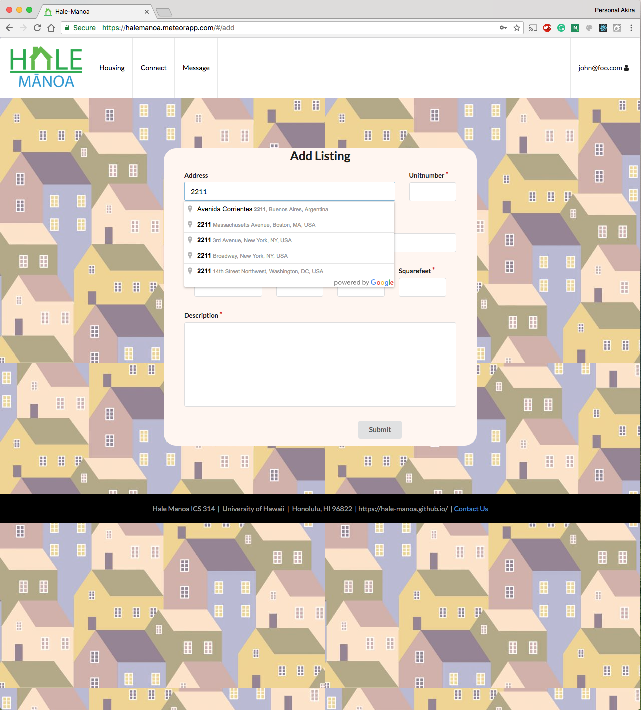
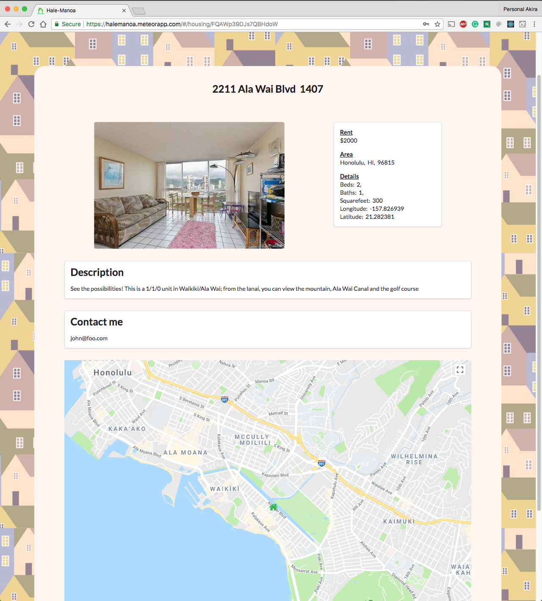
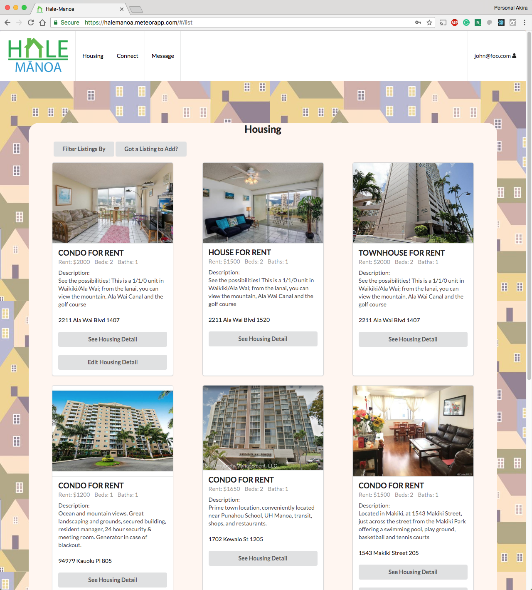

<h1>Overview</h1>

<a href="https://hale-manoa.github.io/">Hale Manoa</a>  is a tool for University of Hawaii at Manoa students to browse available and affordable housing options in the area. Through this web application, users are able to directly compare prices and find housing adequate for their needs. Furthermore, local individuals and businesses are able to advertise their housing options while gaining community recognition through reviews given by other users.

Hale Manoa allows students to find a roommate with similar interests. Students will create their own personal profile with important information such as hobbies, habits, cleanliness, pets, etc. Students can then connect with others and find housing. Some key features include: creating personalized profiles, discovering housing options based on specific characteristics, advertising housing options, and adding reviews / community feedback.

<h1>My Contributions</h1>

I was responsible for both front and back end development of the housing pages which include: add housing, edit housing, and list housing. Geocoding from the google maps api was used to gather the coordinates from the address inputted from the user. From there we were able to pinpoint and display the exact location of the house in the housing detail page.
Below are some screenshots of the housing pages:

<h1>What I Learned</h1>

What I learned from this project was being able to not only work with others but also learning and developing with the React framework/library. Learning about project management practices such as using Github to assign issues and set milestones has allowed us to delegate tasks within our group members with ease. I will definitely be able to carry on this experience of working in a group using project management skills learned from this course to my future careers or courses.

For more information, our homepage is located <a href="https://hale-manoa.github.io/">here.</a>

