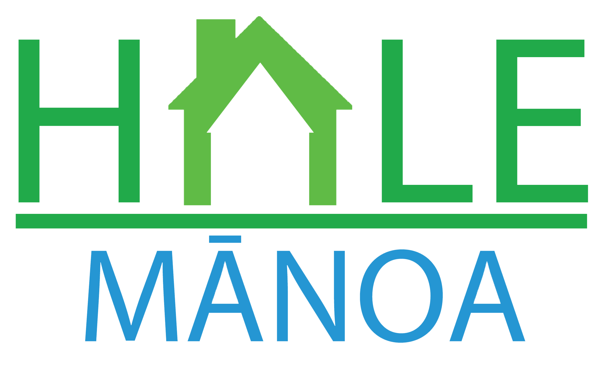

<h1>Overview</h1>

<a href="https://hale-manoa.github.io/">Hale Manoa</a>  is a tool for University of Hawaii at Manoa students to browse available and affordable housing options in the area. With Hale Manoa, users are able to directly compare prices and find housing adequate for their needs. Furthermore, local individuals and businesses are able to advertise their housing options while gaining community recognition through reviews given by other users.

Hale Manoa allows students to find a roommate with similar interests. Students will create their own personal profile with important information such as hobbies, habits, cleanliness, pets, etc. Students can get notified when they have a match. Some key features include: creating personalized profiles, discovering housing options based on specific characteristics, advertising housing options, and adding reviews / community feedback.

<h1>My Contributions</h1>

<h1>What I Learned</h1>

